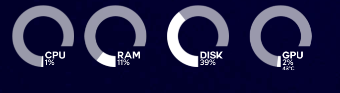

# Thot Disk – KDE Plasma Disk Usage Widget



Also check out **Thot GPU** at https://github.com/kriansh/thot-gpu-inspirational .
Thot Disk is a KDE Plasma widget that provides a minimalist and real-time visualization of disk usage and activity.  
This project is a direct clone and adaptation of **Thot RAM** and **Thot CPU**, originally created by **ZayronXIO**.  
Almost all of the code and the overall design philosophy come from their work, with the main difference being that this widget focuses on disk usage instead of RAM or CPU.

All credit for the original idea, structure, and visual style goes to **ZayronXIO**.

If you like this widget, please make sure to also support the original projects:
- Thot RAM  
- Thot CPU  

by ZayronXIO on the KDE Store and GitHub.

This project exists mainly as an extension of their concept to disk monitoring.

---

## Features

- Real-time disk usage monitoring  
- Disk activity visualization (read/write behavior)  
- Minimalist and clean design identical to Thot RAM and Thot CPU  
- Lightweight and fast  
- Seamless integration with KDE Plasma  
- Simple configuration and customization  

---

## Requirements

- KDE Plasma 5 or Plasma 6  
- Linux system  
- Plasma widgets support  
- Git (for cloning the repository)  

Depending on your Plasma version, you may also need:
- ksysguard / libksysguard (same dependency used by Thot RAM and Thot CPU)

---

## Installation

You can install this widget by cloning the repository into your Plasma plasmoid directory.

Common directories:

User-only installation:
~/.local/share/plasma/plasmoids/

System-wide installation:

/usr/share/plasma/plasmoids/

### Step by step

1. Go to your plasmoid directory:

```bash
cd ~/.local/share/plasma/plasmoids/
```

### Clone the repository
```bash
git clone https://github.com/your-username/thot-disk.git
```

### Restart Plasma Shell
```bash
kquitapp5 plasmashell && plasmashell &
```

Or simply log out and log back in.

---

## Add the Widget

1. Right-click on the desktop or panel  
2. Click **Add Widgets**  
3. Search for **Thot Disk**  
4. Drag it where you want it  

---

## Configuration

Right-click on the widget and choose **Configure Thot Disk**.

Depending on your implementation, configuration options may include:

- Selecting the disk mount point (for example `/`, `/home`, `/mnt/data`)
- Update interval  
- Display mode (percentage, size, or both)  
- Colors and appearance  
- Animation speed  

These options are intentionally similar to those found in **Thot RAM** and **Thot CPU** to keep consistency between widgets.

---

## How It Works

Just like **Thot RAM** and **Thot CPU**:

- The widget uses Plasma data sources to read system statistics.  
- Disk usage is queried from the selected mount point.  
- The UI updates at a fixed interval.  
- Animations represent activity and usage changes.  

### Main Components

| Component            | Description                               |
|---------------------|-------------------------------------------|
| Disk Meter          | Displays the disk usage percentage        |
| Activity Indicator  | Shows disk read/write activity            |
| Text Labels         | Show mount point and numeric values       |
| Animations          | Smooth transitions between values         |

---

## Project Structure

```text
thot-disk/
├── contents/
│   ├── ui/            # QML UI files
│   ├── config/        # Configuration UI and logic
│   └── code/          # Data handling and update logic
├── metadata.json      # Plasma widget metadata
└── README.md
```

Most of this structure is inherited directly from **Thot RAM** and **Thot CPU**.

---

## Customization

You can customize this widget in the same way as **Thot RAM** and **Thot CPU**:

- Change colors inside the QML files  
- Modify animations and timing  
- Adjust layout spacing and sizes  
- Change font style and weight  

### Main Files to Edit
```text
contents/ui/*.qml
contents/code/*.js
```

---

## Troubleshooting

| Problem            | Solution                              |
|--------------------|--------------------------------------|
| Widget not visible | Restart Plasma Shell                 |
| Widget not listed  | Check folder name and metadata.json  |
| No disk data       | Verify the mount point configuration |
| High CPU usage     | Increase update interval             |

Reload Plasma widgets manually:
```bash
plasmashell --replace &
```

---

## Credits

This project is based almost entirely on the work of:

**ZayronXIO**  
Creator of:
- **Thot RAM**
- **Thot CPU**

All original design, widget structure, and core logic belong to them.  
**Thot Disk** only adapts their concept to disk monitoring.

If this project is useful to you, please support the original author and their widgets.

---

## License

Use the same license as the original **Thot RAM** and **Thot CPU** projects, unless you explicitly choose otherwise.

If you are keeping compatibility:

```text
GPL-3.0
```

(Adjust if needed.)

---

## Disclaimer

This project is an unofficial extension of the Thot widget family.  
It is not maintained by **ZayronXIO** and exists purely as a community adaptation.
